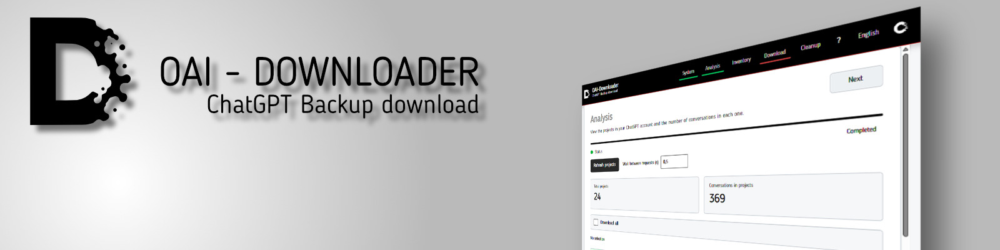
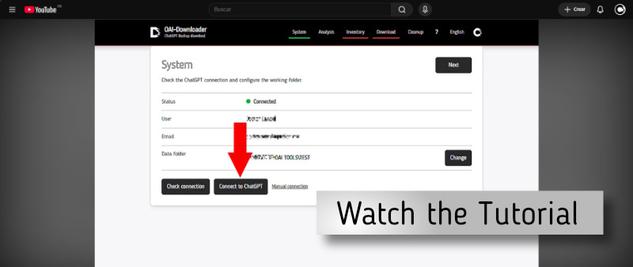

# OAI-Downloader
<p align="center">
  
</p>
OAI-Downloader is a local application for downloading, organizing and inspecting OpenAI / ChatGPT backup data.

It runs locally on your computer and provides a simple web-based interface for connecting to ChatGPT, analyzing available conversations and projects, generating an inventory and downloading backup resources.

Built by **Corrosion Labs**.

## Features

- Local web interface
- ChatGPT session connection
- Account analysis
- Project and conversation detection
- Resource inventory
- Selective backup download
- Download diagnostics
- Local cleanup tools
- English, Spanish and French interface
- Configurable external storage location

## Tutorial
<h2 align="center">Video tutorial</h2>

<p align="center">
  <a href="https://youtu.be/PLQ9iah44tk">
    
  </a>
</p>


## Platform status

### Windows

Tested and supported.

A packaged Windows version will be available from the **GitHub Releases** section.

### Linux / macOS

The Python source is designed to be portable, but Linux and macOS have not yet been officially tested.

Some systems may require additional components for Tkinter or pywebview.

## Run from source

### Requirements

- Python 3
- pip

Clone the repository:

```bash
git clone https://github.com/CorrosionLabs/OAI-Downloader.git
cd OAI-Downloader
```

Install dependencies:

```bash
python -m pip install -r requirements.txt
```

Start the application:

```bash
python run_web.py
```

The application will launch its local interface automatically.

## Storage

OAI-Downloader keeps downloaded data outside the application directory.

By default, data is stored in:

```text
~/OAI-Downloader
```

The storage location can also be changed from the application interface.

## Tutorial

A video tutorial is available on YouTube:

https://youtu.be/PLQ9iah44tk

## Repository

https://github.com/CorrosionLabs/OAI-Downloader

## Security

Authentication data is stored locally.

Do not publish or share cookie files, session credentials or files from `.secrets`.

## Development status

This project is under active development.

The Windows version is currently the reference platform. Linux and macOS compatibility will be verified separately.

## Corrosion Labs

OAI-Downloader is developed by **Corrosion Labs**.

## Support

If you find Concept Indexer useful and want to support its development:

<a href='https://ko-fi.com/Y5Y722A4J4' target='_blank'></a>

